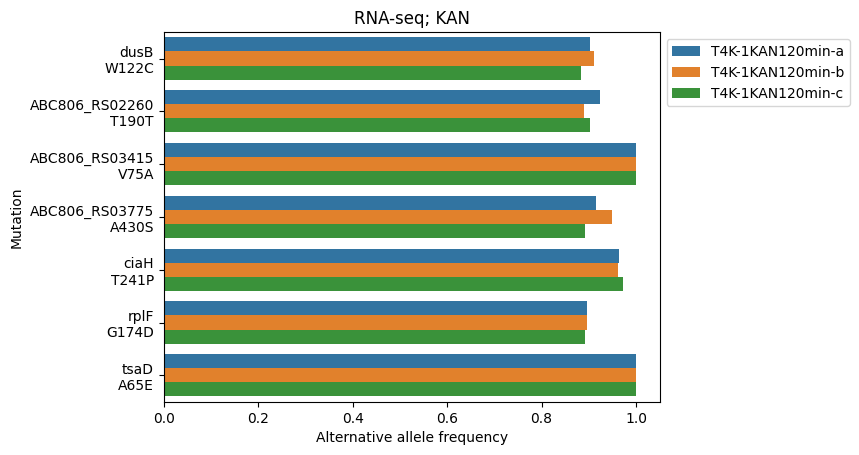
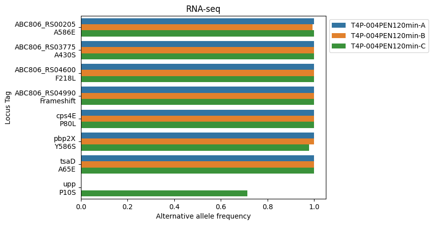
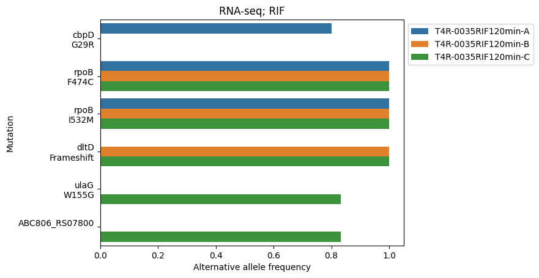
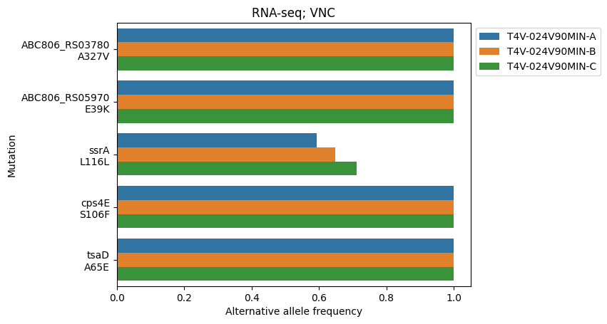
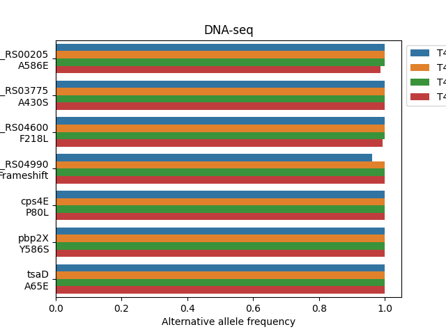
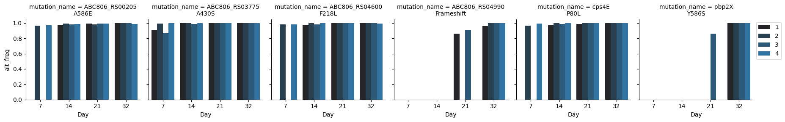

# Adaptation analysis on the entropy dataset 

This repo contains code used in the manuscript "RNA-seq reanalysis identifies murE as a convergent target of 
antibiotic adaptation in Streptococcus pneumoniae"      
The main goal in this project is to see if we can reliably perform variant calling from RNA-seq data. While whole genome sequencing would be the ideal input for variant calling, the data that is already published and publicly accessible is unfortunately RNA-seq. Some disadvantages of RNA-seq data for this purpose are: 
- incomplete coverage: we will only get portions of the genome that are expressed, so intergenic regions are unfortunately not going to be well represented in the RNAseq data
- uneven coverage: we need a region to have high enough expression to be able to get sufficient depth for confident variant calling. We might not have enough depth on genes that are not expressed highly 
- extra step of reverse transcription: I'm not sure how much of an effect this has but there's risk of introducing an error at the RNA --> cDNA step in the prep that may appear as a mutation    
So in order to address the potential shortcomings of RNA-seq data, we will also make a comparison of variant calling with the "right" tool, DNA-seq data

### Environment management
* Use [poetry](https://python-poetry.org/docs/basic-usage/)
* Make sure you have a copy of the `poetry.lock` file, and from the same directory run `poetry init`
* To use jupyter notebooks use `poetry run jupyter lab --allow-root`
  
### Non-python dependencies: 
Refer to `nonpython_install.sh`

## Steps to recreate the analysis
### Variant calling from RNA-seq data
1. Download reference     
   `datasets download genome accession GCF_040687945.1`
2. Download fastqs and run alignments against the reference genome     
    `download_and_align_fastq.sh`    
    This will go through all TIGR4 experiments
3. Call variants     
   `bash variant_calling_abx_adapt.sh`     
   This script will turn bam files into vcf, extract variants in each sample (3 wildtype, 3 adapted), and take the difference between adapted - wildtype to get to a list of mutations uniquely seen in the adapted strain. I ran this script once for each antibiotic adaptation experiment, changing the sample names in between runs.     
4. Annotate variants - add the names of the genes from the reference    
   `bash annotate_adapt_vcf.sh`
5. Post processing on jupyter notebooks under `demos`    
   1. `Adaptive_mutations`: Generate Table 1 (list of all mutations)
   2. `Coverage_summary`: Generate coverage plot for Figure 1, Table 2 (allele depths)

### Variant calling from DNA-seq data
From the computational standpoint, this should look similar to the RNA-seq pipeline. We will use the data published in [Nishimoto et al](https://www.cell.com/cell-reports/fulltext/S2211-1247(22)01727-2) for the TIGR4 Penicillin adapted populations (accession: PRJNA856279 - note that the accession number noted in the paper is a different one for the other sequencing experiments). Here we use a slightly adapted version of the scripts in the RNAseq analysis where the samples have been swapped out for the DNA-seq input: 
- `variant_calling_DNA.sh`    
This script will handle data download for Penicillin adapted and SDMM(no-antibiotic)-adapted populations at Day 32, align to the same reference as before, call variants and generate VCF files, merge the antibiotic adapted and no-antibiotic adapted variant files and take the difference. It will also add in the gene annotations to the final table of variants unique to the Penicillin adapted populations.     
I was also interested in the earlier timepoints of the PEN-evolution experiment, since they were available in the same bioproject; Days 7, 14, 21. The script `variant_calling_DNA_earlier_timepoints.sh` loops through the earlier timepoints, downloads fastq's, aligns and calls variants for each sample. At this point, the aggregation step was not strictly necessary, so the script keeps each independent population/sample, but does subtract mutations found in the SDMM adapted strains.     
- `annotate_DNAseq_all_pops.sh`    
The point of this script is to get annotations for any and all mutations found in the adapted populations at any timepoint. So, here we will merge all mutations unique to each adapted population (output from previous step), and cross reference that with the gene annotations from the reference.     
    

# Results
## RNA-Seq based variant calling
Below is a representative subset of annotated mutations identified in coding regions:
| position | Ref | Alt   | gene | AA change | ABX | Notes              |
|----------|-----|-------|------|-----|-----|--------------------|
| 713637   | C   | A   | murE |A430S| CIP | cell wall synthesis      |
| 1006733  | C   | A,T   | gyrA |S81Y, S81F | CIP | direct target      |
| 1355418  | G   | T,A,C | parC |S79Y, S79F, S79C| CIP | direct target      |
| 54632    | C   | A     | dusB |W122C| KAN |  tRNA processing  |
| 713637   | C   | A   | murE |A430S| KAN | cell wall synthesis      |
| 1403007  | T   | G     | ciaH |T241P| KAN | antibiotic sensing |
| 1955003  | C   | T     | rplF |G174D| KAN |   ribosomal protein- target  |
| 2026741  | G   | T,A   | tsaD |A65E, A65V| KAN | tRNA modification  | 
| 713637   | C   | A   | murE |A430S| PEN | cell wall synthesis      |
| 1450247  | G   | A     | upp  |P10S| PEN |                    |
| 1832114  | G   | A     | cps4E|P80L| PEN | capsule metabolism |
| 1847706  | T   | G     | pbp2X|Y586S| PEN |  direct target   |
| 2026741  | G   | T,A   | tsaD |A65E, A65V| PEN |  tRNA modification   | 
| 41080  | G   | A     | cbpD  |G29R| RIF |  competence induced lysis    |
| 72331  | TC   | T     | dltD|Frameshift| RIF |  cell surface modification |
| 226057  | T   | G     | ulaG|W155G| RIF | vitamin C transport and metabolism |
| 295258  | T   | G   | rpoB |F474C| RIF | direct target   | 
| 295433  | C   | G   | rpoB |I532M| RIF | direct target   | 
| 295258  | T   | G   | ssrA |L116L| VNC | transfer mRNA   | 
| 1832036  | G   | A   | cps4E |S106F| VNC | capsule metabolism   | 
| 2026741  | G   | T,A   | tsaD |A65E, A65V| VNC | tRNA modification   |    

This is not a complete list. Please see the jupyter notebook for the comprehensive list of mutations.     
Across the adaptive evolution experiments, we observe that mutations in the direct targets of the antibiotics arise as expected, including:
- gyrA and parC in fluoroquinolone-adapted strains,
- pbp2X in penicillin-adapted strains,
- cps4E in penicillin and vancomycin adapted strains,
- rpoB in rifampicin-adapted strains.

A recurrent mutation at coordinate 713637 affecting ABC806_RS03775 (annotated as UDP-N-acetylmuramoyl-L-alanyl-D-glutamate–L-lysine ligase, a MurE homolog) appears independently in CIP, PEN, and KAN adapted strains. MurE catalyzes an essential step in peptidoglycan precursor synthesis, and its repeated targeting across distinct antibiotics suggests a convergent adaptive adjustment of cell wall biosynthetic flux under heterogeneous antibiotic stress.     
    

Below are plots of alternative allele frequency in each population - these plots show a nice distinction between mutations that appear only in one replicate vs in all 3 replicates and are more likely to be true adaptive mutations.     
    
    
    
   
    

## DNA-seq based variant calling
### Day 32 of adaptation
From the annotations, we see that there are 6 mutations across the 4 PEN-adapted populations (murE, cps4E, pbp2x, ABC806_RS00205, ABC806_RS04600 and ABC806_RS04990), all of which overlap with the mutations found in the PEN-adapted clone in the RNA-seq data. There were two additional genic mutations found in the RNAseq data - one was on upp, which only appears in one replicate and at lower frequency (~70%), and the other was filtered out from the DNAseq results because it was present in at least one SDMM population. Below are the alternative allele plots for the DNA and RNA seq results for Penicillin (only genic mutations shown). The nice overlap validates the RNA-seq approach, and demonstrates that the clone used in the RNA-seq experiment was NOT some oddball, low frequency genotype in the population, but rather it was representative of the population. 

    
    
    

### Earlier timepoints
The table `All_pops_merged_with_gene_context.tsv` contains the annotated mutations seen across all 16 populations. There are 4 intergenic and 6 genic mutations. The genic mutations do overlap with the RNA-seq based findings. Note that the tsaD mutation that is present in the RNAseq and DNAseq data has been filtered out because it was present in the SDMM-adapted strains. It shows up in the RNAseq final results, because the wildtype baseline we are using there is pre-adaptation. The tsaD mutation is something TIGR4 gains in culture with or without antibiotics.     
      
Note the y-axis. When these mutations appear, they appear at high frequency. The murE mutation in particular appears at Day 7 in all 4 populations at a frequency above 85%, suggesting that this is an early adaptation to antibiotic stress. While we don't have the granular timecourse data for the other antibiotics, it would be interesting to see if it appears early on in the evolution experiments there as well. 

## Genes with interesting mutations
#### murE
Function: MurE is the UDP-MurNAc-tripeptide–L-lysine ligase that adds L-lysine to the peptidoglycan stem peptide, a central step in cell wall biosynthesis.
Adaptation relevance: Altered flux through peptidoglycan synthesis can mitigate imbalances between cell growth and envelope assembly under stress 

#### gyrA / parC
Function: Encode subunits of DNA gyrase (GyrA) and topoisomerase IV (ParC), the canonical fluoroquinolone targets.
Adaptation relevance: Point mutations in these proteins reduce fluoroquinolone binding and confer resistance 

#### dusB
Function: Dihydrouridine synthase B catalyzes formation of dihydrouridine in tRNAs, affecting tRNA flexibility and translational accuracy.
Adaptation relevance: Mutations in tRNA modification enzymes have been associated with altered translation fidelity and antibiotic tolerance 

#### ciaH
Function: Sensor kinase of the two-component CiaRH system, regulating cell wall stress responses, autolysis, and competence.
Adaptation relevance: CiaRH mutants possess altered antibiotic susceptibility profiles and stress resilience 

#### rplF
Function: Ribosomal protein L6 is part of the 50S large subunit and contributes to ribosome stability and function.
Adaptation relevance: Mutations in ribosomal proteins can modulate aminoglycoside interaction and translational dynamics

#### tsaD
Function: Member of the t⁶A tRNA modification pathway, required for synthesis of N⁶-threonylcarbamoyladenosine on ANN-recognizing tRNAs.
Adaptation relevance: Likely not relevant to antibiotics, as it is seen in the SDMM adapted TIGR4 strain in the DNAseq data as well. 

#### cps4E
Function: Capsule biosynthesis enzyme in serotype-specific capsular operons.
Adaptation relevance: Capsule alterations can affect cell surface properties and antibiotic tolerance indirectly, shows up in cell-wall synthesis inhibitors PEN, VNC 

#### pbp2X
Function: Penicillin-binding protein 2X, one of the primary transpeptidases targeted by β-lactams.
Adaptation relevance: Mutations here reduce β-lactam binding and are a well-established mechanism of penicillin resistance in pneumococci 

#### dltD
Function: Part of the DltABCD system that adds D-alanine to teichoic acids, reducing cell surface negative charge.
Adaptation relevance: Altered teichoic acid D-alanination changes cell envelope stress tolerance and can modulate susceptibility to stressors 

#### ssrA
Function: ssrA encodes tmRNA, central to the ribosome rescue system / trans-translation.    
Interpretation: Adaptive response to stalled ribosomes or translation stress.    
Mechanistically, this fits with what you saw in other antibiotics: stress on translation or protein homeostasis pathways prompts convergent selection on supporting systems (tRNA modification + ribosome rescue).

